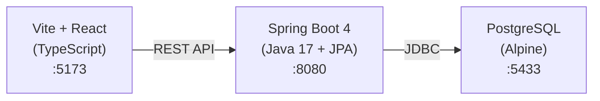
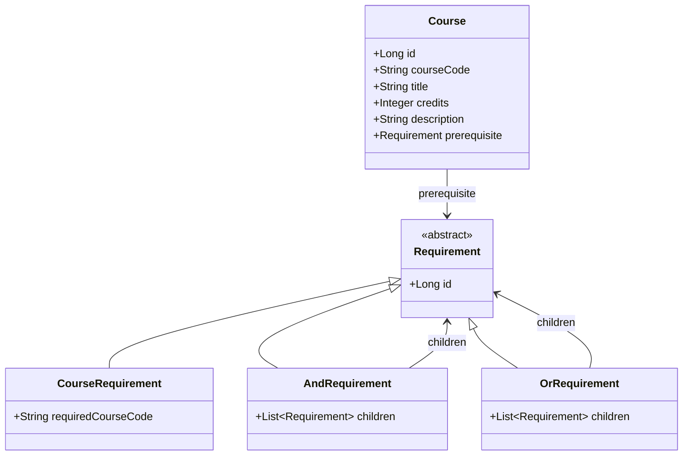

# UMass Amherst BS CS Prerequisite Eligibility Checker

A web application that parses complex, nested AND/OR prerequisite logic to determine if a UMass Amherst CS student can enroll in a target course based on their transcript.

## Architecture



| Layer     | Directory  | Tech Stack                            |
|-----------|-----------|----------------------------------------|
| Frontend  | `client/` | Vite 7, React 19, TypeScript           |
| Backend   | `server/` | Spring Boot 4.0.3, JPA/Hibernate, Flyway |
| Database  | Docker    | PostgreSQL Alpine via `docker-compose`  |

## Data Model — Composite Pattern

The prerequisite system uses the **Composite Design Pattern** to model arbitrarily nested AND/OR logic as a tree:



### Example

**COMPSCI 220** requires: `COMPSCI 187 AND (MATH 131 OR MATH 132)`

```
Course(COMPSCI 220)
  └── prerequisite → AND
                      ├── COURSE("COMPSCI 187")
                      └── OR
                            ├── COURSE("MATH 131")
                            └── COURSE("MATH 132")
```

## Prerequisites

- **Java 17+** (for Spring Boot)
- **Node.js 18+** with **Corepack** enabled for the Vite frontend
- **Docker** and **Docker Compose** (for PostgreSQL)

## Getting Started

### 1. Start the Database

```bash
docker compose up -d
```

This starts a lightweight PostgreSQL Alpine container with:
- **Database:** `coursechecker_db`
- **User:** `coursechecker`
- **Password:** `coursechecker`
- **Port:** `5433` (mapped from container's 5432 to avoid conflicts with native Postgres)

### 2. Start the Backend

```bash
cd server
./mvnw spring-boot:run -Dspring-boot.run.profiles=dev
```

On first startup, Spring Boot will:
1. Run **Flyway migrations** to create the schema
2. Run the **DatabaseSeeder** to inject mock courses, users, and transcript data

The API is available at `http://localhost:8080`.

> **Note:** The `dev` profile is required to activate the seeder. Without it, migrations still run but no seed data is inserted. See [Seed Data System](#seed-data-system) below.

### 3. Populate Course Data from UMass PDF Imports

The admin import endpoint is asynchronous and protected by `X-Admin-Secret`.
For local development, the default secret is:

- `coursechecker-local-admin-secret`

Set local variables:

```bash
API_BASE="http://localhost:8080"
ADMIN_SECRET="coursechecker-local-admin-secret"
```

Submit import jobs (3 PDFs):

```bash
curl -sS -X POST "$API_BASE/api/v1/admin/imports/pdf-url" \
  -H "Content-Type: application/json" \
  -H "X-Admin-Secret: $ADMIN_SECRET" \
  -d '{"sourcePageUrl":"https://www.cics.umass.edu/media/7501/download?attachment"}'

curl -sS -X POST "$API_BASE/api/v1/admin/imports/pdf-url" \
  -H "Content-Type: application/json" \
  -H "X-Admin-Secret: $ADMIN_SECRET" \
  -d '{"sourcePageUrl":"https://www.cics.umass.edu/media/8761/download?attachment"}'

curl -sS -X POST "$API_BASE/api/v1/admin/imports/pdf-url" \
  -H "Content-Type: application/json" \
  -H "X-Admin-Secret: $ADMIN_SECRET" \
  -d '{"sourcePageUrl":"https://www.cics.umass.edu/media/9986/download?attachment"}'
```

Each response includes a `jobId`. Poll each job until terminal status:

```bash
JOB_ID="<paste-job-id>"
curl -sS -H "X-Admin-Secret: $ADMIN_SECRET" \
  "$API_BASE/api/v1/admin/imports/$JOB_ID?includeResults=true"
```

Terminal status values:
- `SUCCEEDED`: import completed successfully
- `PARTIAL_SUCCESS`: usable data imported, inspect warnings/errors
- `FAILED`: import failed, inspect `errorMessage` and job results

Import jobs now include parser diagnostics:

- `prerequisiteTextExtractedCount`: courses where prerequisite text was found in the PDF
- `prerequisiteParsedCount`: courses where a prerequisite tree was successfully built
- `prerequisiteParseFailedCount`: courses imported with warning details because prerequisite parsing failed

Per-course warning objects include:

- `warning.code`
- `warning.detail`
- `warning.rawPrerequisiteText`
- `warning.normalizedPrerequisiteText`

When a prerequisite cannot be parsed, inserts still proceed, updates preserve any existing prerequisite tree, and the job usually finishes as `PARTIAL_SUCCESS` so the warning can be inspected.

Inspect per-course results:

```bash
curl -sS -H "X-Admin-Secret: $ADMIN_SECRET" \
  "$API_BASE/api/v1/admin/imports/$JOB_ID/results"
```

Quick verification that data is searchable:

```bash
curl -sS "$API_BASE/api/v1/courses/search?q=COMPSCI"
```

### 4. Start the Frontend

```bash
cd client
corepack yarn install   # first time only
corepack yarn dev
```

The UI is available at `http://localhost:5173`.

### Flyway Local Troubleshooting

If backend startup fails with migration checksum mismatch (for example, a stale local `flyway_schema_history`), reset local DB state and re-run setup:

```bash
docker compose down -v && rm -rf docker/postgres-data
docker compose up -d
```

## Project Structure

```
CourseChecker/
├── client/                     # Vite + React frontend
│   ├── src/
│   ├── package.json
│   └── vite.config.ts
├── server/                     # Spring Boot backend
│   ├── src/main/java/com/example/server/
│   │   ├── model/              # JPA entities (Composite Pattern)
│   │   │   ├── Course.java
│   │   │   ├── Requirement.java        # abstract base
│   │   │   ├── CourseRequirement.java  # leaf
│   │   │   ├── AndRequirement.java     # composite
│   │   │   ├── OrRequirement.java      # composite
│   │   │   └── CompletedCourse.java    # transcript
│   │   ├── repository/         # Spring Data JPA repos
│   │   └── seed/               # Decoupled seed data system
│   │       ├── CourseDataProvider.java      # interface
│   │       ├── MockCourseDataProvider.java  # mock data
│   │       ├── DatabaseSeeder.java          # insertion logic
│   │       ├── CourseDefinition.java        # DTO
│   │       └── RequirementDefinition.java   # recursive DTO
│   ├── src/main/resources/
│   │   ├── application.yaml
│   │   └── db/migration/       # Flyway SQL migrations
│   └── pom.xml
├── docker-compose.yml
├── claude.md                   # Agent memory
└── README.md
```

## Database Management

```bash
# Start
docker compose up -d

# Stop (preserves data)
docker compose down

# Reset (destroys all data)
docker compose down -v && rm -rf docker/postgres-data
```

## Seed Data System

The seeder runs automatically on startup when the `dev` Spring profile is active (`@Profile("dev")`).

### Activating the Seeder

```bash
# Recommended: pass the profile via Maven
cd server && ./mvnw spring-boot:run -Dspring-boot.run.profiles=dev

# Alternative: environment variable
export SPRING_PROFILES_ACTIVE=dev
cd server && ./mvnw spring-boot:run
```

The seeder is **idempotent** — safe to re-run; it skips rows that already exist.

### What Gets Seeded

**Users** (password for both: `password123!`):

| studentId | Name | Email |
|-----------|------|-------|
| `student-001` | John Doe | jdoe@umass.edu |
| `student-002` | Jane Smith | jsmith@umass.edu |

**Transcripts** (completed courses per user):

| studentId | Completed |
|-----------|-----------|
| `student-001` | COMPSCI 121, COMPSCI 187, MATH 131 — eligible for COMPSCI 220 |
| `student-002` | COMPSCI 121, MATH 132 — missing COMPSCI 187, ineligible for COMPSCI 220 |

**Courses**:
Courses catalog information are also seeded under dev profile.

### Architecture

The seed system is designed for **data source swappability**:

- `CourseDataProvider` (interface) — defines the data contract
- `MockCourseDataProvider` — current implementation with hardcoded test data
- `DatabaseSeeder` — handles DB insertion (decoupled from data source)

To swap the data source, create a new `CourseDataProvider` implementation annotated with `@Component` and `@Primary`. The `DatabaseSeeder` picks it up via dependency injection with no other changes required.

## Testing

Both backend and frontend have separate routine and stress-test entry points. Routine commands exclude stress tests; stress suites are opt-in.

### Backend (Maven / JUnit)

```bash
cd server

# Routine tests (excludes @Tag("stress"))
./mvnw test

# Stress tests only (activates the `stress-tests` Maven profile)
./mvnw test -Pstress-tests
```

### Frontend (Vitest)

```bash
cd client
corepack yarn install   # first time only

# Routine tests (unit + integration; excludes *.stress.test.* and *.e2e.test.*)
corepack yarn test

# Targeted suites
corepack yarn test:unit
corepack yarn test:integration

# Stress tests only
corepack yarn test:stress

# Watch mode (routine tests, re-runs on change)
corepack yarn test:watch
```

### Cross-Stack (Frontend ↔ Backend)

The `*.e2e.test.*` suite under `client/src/e2e/` exercises the real frontend API client against a **live backend**. Bring the stack up first with the `dev` profile so seed data is present:

```bash
docker compose up -d
cd server && ./mvnw spring-boot:run -Dspring-boot.run.profiles=dev
```

Then in another terminal:

```bash
cd client
corepack yarn test:e2e
```

These tests are excluded from `yarn test` and `yarn test:watch` because they require the backend to be running.

## Contributing

Use **Conventional Commits** for all commit messages:

```
feat: add prerequisite checking endpoint
fix: correct OR logic in requirement evaluation
chore: update dependencies
docs: improve setup instructions
```
